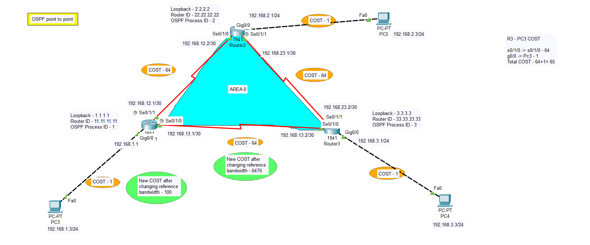

**# OSPF Point-to-Point Configuration**

  
*Figure 1: Overview of OSPF in network topology*


## **Router Configurations**

### **R1**
```shell
en
conf t
hostname R1
int g0/0
ip add 192.168.1.1 255.255.255.0
no shut

int s0/1/1
ip add 192.168.12.1 255.255.255.252
clock rate 2000000
no shut

int s0/1/0
ip add 192.168.13.1 255.255.255.252
clock rate 2000000
no shut
```

### **R2**
```shell
en
conf t
hostname R2
int g0/0
ip add 192.168.2.1 255.255.255.0
no shut

int s0/1/0
ip add 192.168.12.2 255.255.255.252
clock rate 2000000
no shut

int s0/1/1
ip add 192.168.23.1 255.255.255.252
clock rate 2000000
no shut
```

### **R3**
```shell
en
conf t
hostname R3
int g0/0
ip add 192.168.3.1 255.255.255.0
no shut

int s0/1/0
ip add 192.168.13.2 255.255.255.252
clock rate 2000000
no shut

int s0/1/1
ip add 192.168.23.2 255.255.255.252
clock rate 2000000
no shut
```

---

## **OSPF Configuration**

### **R1**
```shell
router ospf 1
network 192.168.1.0 0.0.0.255 area 0
network 192.168.12.0 0.0.0.3 area 0
network 192.168.13.0 0.0.0.3 area 0
```

### **R2**
```shell
router ospf 2
network 192.168.2.0 0.0.0.255 area 0
network 192.168.12.0 0.0.0.3 area 0
network 192.168.23.0 0.0.0.3 area 0
```

### **R3**
```shell
router ospf 3
network 192.168.3.0 0.0.0.255 area 0
network 192.168.13.0 0.0.0.3 area 0
network 192.168.23.0 0.0.0.3 area 0
```

---

## **Verification Commands**

### **R1**
```shell
show ip ospf neighbor
show ip ospf route
show ip ospf database
show ip protocols
```

---

## **Loopback Interface Configuration**

### **R1**
```shell
int loopback 1
ip add 1.1.1.1 255.255.255.0
copy running-config startup-config
reload
```

### **R2**
```shell
int loopback 2
ip add 2.2.2.2 255.255.255.0
copy running-config startup-config
reload
```

### **R3**
```shell
int loopback 3
ip add 3.3.3.3 255.255.255.0
copy running-config startup-config
reload
```

---

## **Change Router ID**

### **R1**
```shell
conf t
router ospf 1
router-id 11.11.11.11
end
clear ip ospf process
yes
```

### **R2**
```shell
conf t
router ospf 2
router-id 22.22.22.22
end
clear ip ospf process
yes
```

### **R3**
```shell
conf t
router ospf 3
router-id 33.33.33.33
end
clear ip ospf process
yes
```

---

## **Passive Interface for Gigabit Ethernet Ports**

### **R1**
```shell
conf t
router ospf 1
passive-interface g0/0
```

### **R2**
```shell
conf t
router ospf 2
passive-interface g0/0
```

### **R3**
```shell
conf t
router ospf 3
passive-interface g0/0
```

---

## **Show OSPF Routing Table**
```shell
R1#show ip route
```

---

## **Change Reference Bandwidth**

### **R1, R2, R3**
```shell
conf t
router ospf 2
auto-cost reference-bandwidth 10000
```

### **Reverse Reference Bandwidth Configuration**
```shell
conf t
router ospf 3
auto-cost reference-bandwidth 100
```

---

## **Change Interface Bandwidth**

### **R1, R2, R3**
```shell
conf t
int s0/1/1
bandwidth 128
```

---

## **Show OSPF Routes**
```shell
R1#show ip route ospf
