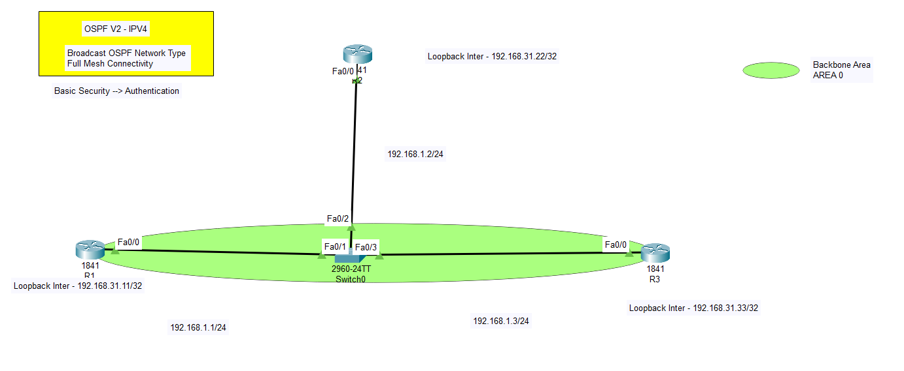

## R1, R2, R3 Basic Routing Configurations

  
*Figure 1: Overview of OSPF in network topology*

### R1
```shell
hostname R1
int f0/0 
ip add 192.168.1.1 255.255.255.0
no shut
interface loopback 0
ip add 192.168.31.11 255.255.255.255
```

### R2
```shell
hostname R2
int f0/0 
ip add 192.168.1.2 255.255.255.0
no shut
interface loopback 0
ip add 192.168.31.22 255.255.255.255
```

### R3
```shell
hostname R3
int f0/0 
ip add 192.168.1.3 255.255.255.0
no shut
interface loopback 0
ip add 192.168.31.33 255.255.255.255
```

## OSPF Configuration

### R1, R2, R3
```shell
router ospf 10
network 192.168.1.0 0.0.0.255 area 0

show ip protocols
show ip ospf neighbor
show ip ospf neighbor detail
show ip ospf interface f0/0
```

## Change Hello and Dead Intervals

### R1
```shell
int f0/0
ip ospf hello-interval 5
ip ospf dead-interval 20
end
debug ip ospf events
```

## Reverse the Changes

```shell
int f0/0
ip ospf hello-interval 10
ip ospf dead-interval 40
end
debug ip ospf events
```

## Implement Security

```shell
int f0/0
ip ospf me
ip ospf message-digest-key 1 md5 hello

router ospf 1
area 0 authentication message-digest
